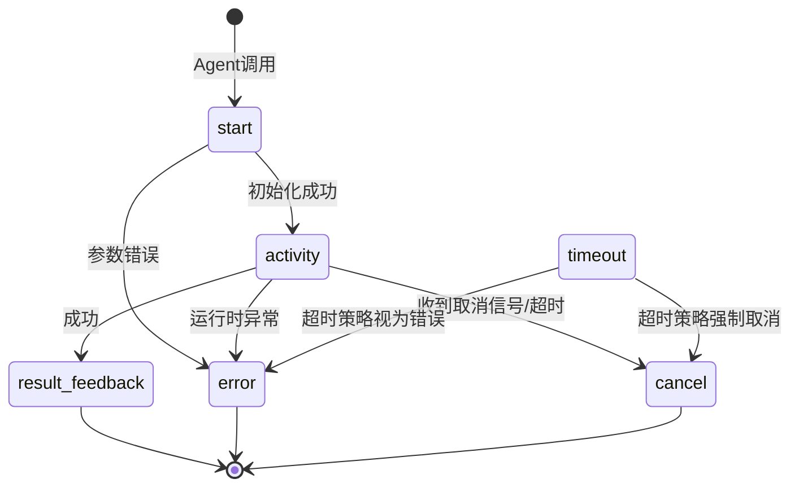
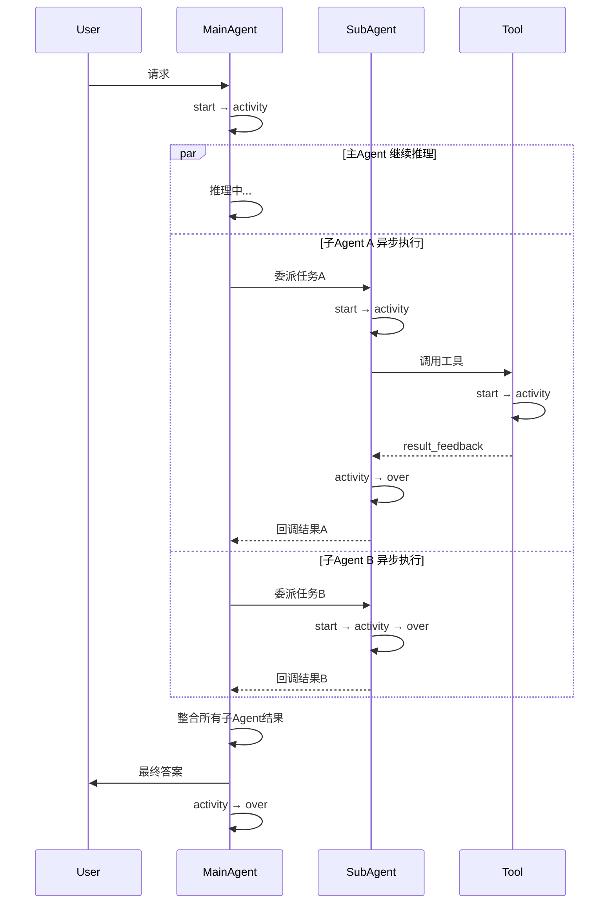
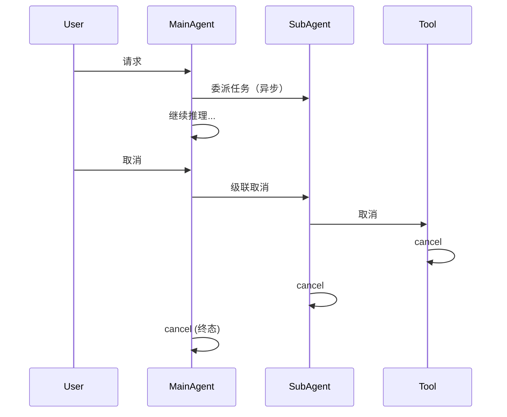

# Agent 全生命周期技术规范

> 版本：1.0
> 适用范围：主Agent、子Agent、工具的统一生命周期管理
> 更新日期：2026-06-02

---

## 1. 概述

在复杂的 Agent 系统中，**主Agent**、**子Agent** 和 **工具** 是三类核心执行单元。它们共享相似的状态机模型，但在触发方式、嵌套关系、资源归属上存在差异。本文档定义了这三者的统一生命周期，并给出实现建议与测试策略。

### 1.1 设计原则

- **状态可观测**：每个状态转换都应有明确的日志或埋点。
- **异常明确**：区分用户主动暂停、系统委派等待、异常错误、超时等不同场景。
- **级联控制**：父级（主Agent）的生命周期变更（如取消、暂停）应可传递至子Agent和工具。
- **终态唯一**：`over`（正常结束）和 `cancel`（强制终止）为两类不同的终态。

---

## 2. 核心状态定义（共用基础）

所有 Agent（主/子）及工具都基于以下状态枚举，但部分状态在特定角色下可能受限或不适用。

| 状态 | 类型 | 说明 |
|------|------|------|
| `start` | 初始态 | 实例已创建，尚未开始执行 |
| `activity` | 活动态 | 正在执行主要逻辑（推理、调用、计算） |
| `pause` | 暂停态 | 用户主动请求的暂停，可恢复 |
| `delegate` | 并发标记 | 有活跃的子Agent正在异步执行（不阻塞主Agent推理） |
| `timeout` | 超时暂态 | 执行时间超过预设阈值，可触发重试或转为错误 |
| `retry` | 重试态 | 自动重试错误或超时的操作 |
| `error` | 错误态 | 发生不可自动恢复的异常，等待决策 |
| `cancel` | 取消终态 | 被强制终止，非常规结束 |
| `over` | 正常终态 | 任务成功完成，自然退出 |

> 注：`result_feedback` 专用于工具的成功返回，不是独立状态而是终态事件。

---

## 3. 主Agent生命周期

主Agent直接面向用户，是系统的入口点。

### 3.1 状态转换表

| 当前状态 | 事件 | 下一状态 | 说明 |
|----------|------|----------|------|
| (无) | 用户请求 | `start` | 创建实例 |
| `start` | 初始化成功 | `activity` | 开始执行 |
| `activity` | 用户暂停 | `pause` | 保存上下文 |
| `pause` | 用户恢复 | `activity` | 恢复上下文 |
| `activity` | 委派子Agent | `activity` + `delegate` 标记 | 异步派发，主Agent继续推理，子Agent结果回调汇入 |
| `activity` | 所有子Agent完成 | 清除 `delegate` 标记 | 仍在 `activity` |
| `activity` / `delegate` / `pause` | 内部异常 | `error` | 记录错误 |
| `error` | 用户重试 | `retry` → `activity` | 重置部分状态 |
| `error` | 用户取消 | `cancel` | 强制结束 |
| `activity` / `pause` / `error` | 用户/系统取消 | `cancel` | 立即终止，级联取消所有活跃子Agent |
| `activity` | 任务自然完成 | `over` | 返回结果 |

> **重要变更**：`delegate` 不再是阻塞状态，而是 `activity` 的并发标记。主Agent 派发子Agent后**立即继续推理**，子Agent 结果通过异步回调汇入。这确保子Agent的并行价值不被串行等待所抵消。

### 3.2 允许的终态

- `over`：正常结束
- `cancel`：强制取消

### 3.3 特殊行为

- **暂停期间**：不处理任何用户输入（除恢复和取消），可持久化到存储。
- **委派期间**：主Agent继续异步执行新推理，同时持续监听子Agent信号。子Agent的结果通过回调/事件机制汇入主Agent的推理流。这是子Agent存在的核心价值——让主Agent能并行处理多个子任务，而非串行等待。
- **取消级联**：主Agent取消时，必须向所有活跃的子Agent和工具发送取消信号。

---

## 4. 子Agent生命周期

子Agent由主Agent（或其他子Agent）通过 `delegate` 发起，执行专门任务。

### 4.1 与主Agent的差异

| 维度 | 主Agent | 子Agent |
|------|---------|---------|
| 状态定义 | 相同 | 相同（复用状态机） |
| 用户主动暂停 | ✅ 支持 | ❌ 不支持（除非通过父Agent转发） |
| 触发者 | 用户请求 | 父Agent调用 |
| 生命周期嵌套 | 顶层 | 嵌套在父Agent的 `delegate` 内 |
| 取消信号来源 | 用户/系统 | 父Agent（级联） |

### 4.2 状态转换（简表）

子Agent的状态转换逻辑与主Agent完全一致，但：

- 没有从外部直接接收 `pause` 的事件（除非系统实现了级联暂停）。
- `delegate` 用于等待更深层的子Agent（支持多层嵌套）。
- `cancel` 通常由父Agent的取消事件触发。

### 4.3 嵌套关系示例（异步并行）

```
主Agent: start → activity ──────────────────────────────────────────────→ ... → over
                │                                                          ↑
                │ 创建子Agent A（异步）                                       │
                ├──→ 子A: start → activity → ... → over → (事件回调) ───────┤
                │                                                          │
                │ 继续推理... 创建子Agent B（异步）                             │
                ├──→ 子B: start → activity → ... → over → (事件回调) ───────┤
                │                                                          │
                │ 继续推理... 创建子Agent C（异步）                             │
                └──→ 子C: start → activity → error → (错误回调) ────────────┘

关键：主Agent 在 activity 状态下并行运行，子Agent 的结果异步汇入，
      主Agent 不会阻塞等待任何单个子Agent。
```

---

## 5. 工具生命周期

工具是Agent能力的实际执行单元（如API调用、代码运行、文件读写）。其生命周期相对简化，没有 `pause` 和 `delegate`。

### 5.1 状态定义

| 状态 | 类型 | 说明 |
|------|------|------|
| `start` | 初始态 | 参数校验，准备资源 |
| `activity` | 活动态 | 正在执行具体逻辑（IO、计算） |
| `result_feedback` | 成功终态 | 执行成功，返回结果给Agent |
| `error` | 失败终态 | 执行过程抛出异常 |
| `cancel` | 取消终态 | 被父Agent强制终止（如用户取消） |
| `timeout` | 超时暂态 | 执行超时，可转为 `cancel` 或 `error` |

### 5.2 状态转换图



### 5.3 与Agent的交互

- Agent 在 `activity` 状态下调用工具。对于快速工具（< 1s），Agent 保持 `activity` 不变；对于耗时工具，Agent 可选择转入 `delegate` 或子状态 `waiting_tool`。
- Agent 取消时，必须级联取消正在运行的 `activity` 状态的工具。
- 工具的超时控制应由Agent或工具管理器负责，超时后触发工具的 `cancel` 或 `error`。

---

## 6. 三者的统一交互时序图

### 6.1 正常流程（异步并行）



> 核心要点：主Agent 在委派后**不阻塞**，继续推理和整合结果；子Agent 通过异步回调/事件通知主Agent。

### 6.2 取消流程（级联）



---

## 7. 测试策略

测试分为三层：**单元测试**（状态机逻辑）、**集成测试**（组件交互）、**端到端测试**（真实场景）以及**混沌测试**（异常注入）。

### 7.1 单元测试（状态转换）

| 测试ID | 对象 | 场景 | 初始状态 | 事件 | 期望下一状态 |
|--------|------|------|----------|------|--------------|
| UT-M-1 | 主Agent | 正常启动 | - | 用户请求 | `activity` |
| UT-M-2 | 主Agent | 用户暂停 | `activity` | 暂停信号 | `pause` |
| UT-M-3 | 主Agent | 恢复暂停 | `pause` | 恢复信号 | `activity` |
| UT-M-4 | 主Agent | 调用子Agent | `activity` | 委派 | `delegate` |
| UT-M-5 | 主Agent | 子Agent完成 | `delegate` | 子Agent返回 | `activity` |
| UT-M-6 | 主Agent | 内部异常 | `activity` | 抛出异常 | `error` |
| UT-M-7 | 主Agent | 错误后用户重试 | `error` | 重试指令 | `retry` → `activity` |
| UT-M-8 | 主Agent | 任意状态取消 | `activity`/`delegate`/`pause`/`error` | 取消信号 | `cancel` |
| UT-S-1 | 子Agent | 正常执行并返回 | `start` | 父Agent调用 | `activity` → `over` |
| UT-S-2 | 子Agent | 等待子子Agent | `activity` | 调用子子Agent | `delegate` |
| UT-S-3 | 子Agent | 父Agent取消 | `activity` | 收到父取消信号 | `cancel` |
| UT-T-1 | 工具 | 正常执行 | `start` | 执行成功 | `activity` → `result_feedback` |
| UT-T-2 | 工具 | 执行失败 | `activity` | 运行时异常 | `error` |
| UT-T-3 | 工具 | 被取消 | `activity` | 取消信号 | `cancel` |
| UT-T-4 | 工具 | 执行超时 | `activity` | 超时计时器 | `timeout` → `cancel` |

### 7.2 集成测试（组件交互）

| 测试ID | 场景 | 操作 | 预期结果 |
|--------|------|------|----------|
| IT-1 | 主Agent调用子Agent，子Agent成功 | 完整调用链 | 主Agent从 `delegate` 恢复，子Agent `over` |
| IT-2 | 子Agent调用工具成功 | 子Agent调用工具 | 工具 `result_feedback`，子Agent继续 |
| IT-3 | 工具超时 | 模拟工具耗时 > 超时阈值 | 工具进入 `cancel`/`error`，父Agent收到错误 |
| IT-4 | 多层嵌套（主→子→子→工具） | 深度调用 | 所有层级状态正确，最终返回结果 |
| IT-5 | 主Agent取消时级联取消子Agent和工具 | 在子Agent `activity` 时取消主Agent | 子Agent和工具进入 `cancel`，资源释放 |
| IT-6 | 子Agent重试 | 子Agent首次失败，允许重试 | 子Agent经历 `error`→`retry`→`activity`→`over` |

### 7.3 端到端测试（真实用户交互）

| 场景 | 步骤 | 预期结果 |
|------|------|----------|
| 正常天气查询 | 用户"北京天气" → 主Agent调用天气工具 → 返回结果 | UI显示温度，主Agent终态 `over` |
| 用户主动暂停与恢复 | 任务中点击暂停 → 等待 → 恢复 | UI显示暂停状态，恢复后继续执行 |
| 子Agent耗时较长 | 用户请求需要子Agent的任务 | UI显示"正在委派子Agent..."，最终成功 |
| 子Agent失败后用户重试 | 子Agent模拟失败 → 显示错误 → 用户点击重试 | 重试成功，完成任务 |
| 强制取消 | 任务执行中点击取消 | 立即停止，状态 `cancel`，可发起新请求 |
| 工具超时自动重试 | 工具超时一次，第二次成功 | 用户可能看到一次重试提示，最终成功 |

### 7.4 混沌测试（异常注入）

| 场景 | 注入方式 | 期望行为 |
|------|----------|----------|
| 子Agent崩溃 | 子Agent进程突然终止 | 主Agent收到连接错误，进入 `error` |
| 工具回调丢失 | 工具执行成功但网络故障无法回调 | 超时机制兜底，主Agent进入 `error` |
| 状态存储失败 | 数据库写入异常（暂停时） | 主Agent进入 `error`，不丢失已有上下文 |
| 并发调用同一工具 | 多个Agent同时调用非线程安全工具 | 工具实例隔离或抛出 `error` |

---

## 8. 实现建议

### 8.1 统一状态机类（伪代码）

```python
class AgentStateMachine:
    def __init__(self, role: str = "main"):  # main, sub, tool
        self.state = "start"
        self.role = role

    def can_transition(self, event):
        # 根据角色和当前状态返回允许的事件列表
        pass

    def transition(self, event):
        if not self.can_transition(event):
            raise InvalidTransitionError
        old = self.state
        self.state = self._next_state(event)
        self._log_transition(old, self.state, event)
        return self.state

    # 为不同角色定制行为
    def pause(self):
        if self.role != "main":
            raise PermissionError("只有主Agent可以暂停")
        return self.transition("pause")
```

### 8.2 级联控制实现

- 父Agent维护所有活跃子Agent和工具的句柄列表。
- 父Agent进入 `cancel` 或 `pause`（如果支持级联暂停）时，遍历列表调用相应方法。
- 子Agent完成或取消后，从父列表中移除。

### 8.3 超时管理

- 为每个 `activity` 状态的子Agent或工具设置定时器。
- 超时后触发 `timeout` 事件，根据策略决定是否重试或直接报错。

---

## 9. 附录：状态速查表

| 状态 | 主Agent | 子Agent | 工具 |
|------|---------|---------|------|
| `start` | ✅ | ✅ | ✅ |
| `activity` | ✅ | ✅ | ✅ |
| `pause` | ✅ | ⚠️（仅级联） | ❌ |
| `delegate` | ✅ | ✅ | ❌ |
| `timeout` | ✅ | ✅ | ✅ |
| `retry` | ✅ | ✅ | ❌（由Agent控制） |
| `error` | ✅ | ✅ | ✅ |
| `cancel` | ✅ | ✅ | ✅ |
| `over` | ✅ | ✅ | ✅（result_feedback替代） |

---

**文档结束**

如需进一步细化某个章节（如API设计、代码示例），请告知具体需求。
