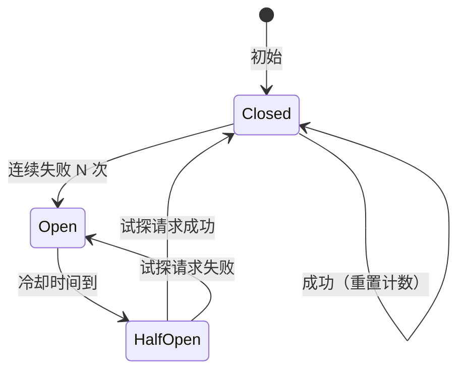

# 错误处理与弹性策略

> 版本：1.0  
> 适用范围：重试、降级、熔断、超时的完整弹性策略  
> 更新日期：2026-06-02

---

## 1. 概述

Agent 系统的错误处理面临独特挑战：LLM 非确定性输出、工具调用的外部依赖不可控、嵌套子 Agent 的级联失败。本文档定义了从单次工具调用到全局系统的分层弹性策略。

### 1.1 核心原则

- **快速失败 > 无限等待**：每个操作有明确超时，超时后进入决策流程而非挂起
- **优雅降级 > 完全不可用**：部分功能失败时，系统应降级而非崩溃
- **自愈 > 人工介入**：可自动恢复的错误应自动重试，仅在不可恢复时通知用户
- **用户可见 > 静默失败**：错误状态和恢复进度应对用户透明

---

## 2. 错误分类体系

### 2.1 错误类型定义

```
Error
├── RetryableError（可重试）
│   ├── TimeoutError          — 超时，等待后可重试
│   ├── NetworkError          — 网络临时不可达
│   ├── RateLimitError        — 频率限制，等待后重试
│   └── TemporaryUnavailable  — 服务临时不可用（503）
│
├── NonRetryableError（不可重试）
│   ├── InvalidArgsError      — 参数校验失败
│   ├── PermissionError       — 权限不足
│   ├── NotFoundError         — 资源不存在
│   └── QuotaExceededError    — 配额耗尽
│
├── DegradableError（可降级）
│   ├── SubAgentFailed        — 子 Agent 失败，可用缓存结果
│   ├── ToolDeprecated        — 工具已废弃，换用替代工具
│   └── PartialDataAvailable  — 部分数据可用，返回不完整结果
│
└── FatalError（致命）
    ├── ConfigCorrupted        — 配置文件损坏
    ├── DBCorrupted            — 数据库损坏
    └── SecurityViolation      — 安全规则触发
```

### 2.2 当前实现对照

```go
// internal/ai/base/types.go
type ToolError struct {
    Code      ErrorCode `json:"code"`
    Message   string    `json:"message"`
    Retryable bool      `json:"retryable"`
    RetryHint string    `json:"retry_hint,omitempty"`
    Fallback  *ToolResult `json:"fallback,omitempty"`  // 降级结果
}

// 错误分类（middleware/chain.go）
func classifyError(err error) ErrorCode {
    msg := err.Error()
    switch {
    case contains(msg, "timeout", "deadline exceeded"):
        return ErrTimeout
    case contains(msg, "permission denied", "access denied"):
        return ErrPermission
    case contains(msg, "connection refused", "no such host"):
        return ErrNetwork
    case contains(msg, "not found", "no such file"):
        return ErrNotFound
    case contains(msg, "invalid", "bad request"):
        return ErrInvalidArgs
    default:
        return ErrExecFailed
    }
}
```

### 2.3 错误响应结构

```json
{
  "error": {
    "code": "timeout",
    "message": "工具 file_read 执行超时（30s）",
    "retryable": true,
    "retry_hint": "建议延长超时时间或缩小读取范围",
    "fallback": null,
    "trace_id": "tr_def456",
    "timestamp": "2026-06-02T15:04:05Z"
  }
}
```

---

## 3. 重试策略

### 3.1 重试配置模型

```go
// 每个工具可独立配置重试策略
type RetryPolicy struct {
    MaxRetries int           `json:"max_retries"`  // 最大重试次数，默认 1
    BackoffMs  int           `json:"backoff_ms"`   // 基础退避时间，默认 1000ms
    MaxBackoff time.Duration `json:"max_backoff"`  // 最大退避时间
    Jitter     float64       `json:"jitter"`       // 抖动因子 [0, 1]，默认 0.1
}
```

### 3.2 指数退避算法

```go
// 当前实现（middleware/chain.go）
func (c *Chain) Execute(ctx context.Context, call ToolCall) *ToolResult {
    policy := c.resolveRetryPolicy(call.Name)
    
    for attempt := 0; attempt <= policy.MaxRetries; attempt++ {
        result := c.executeOnce(ctx, call)
        
        if result.Error == nil {
            return result  // 成功
        }
        
        if !result.Error.Retryable {
            return result  // 不可重试，立即返回
        }
        
        if attempt < policy.MaxRetries {
            // 指数退避 + 抖动
            backoff := time.Duration(policy.BackoffMs*(attempt+1)) * time.Millisecond
            if jittered := addJitter(backoff, policy.Jitter); jittered > 0 {
                select {
                case <-time.After(jittered):
                case <-ctx.Done():
                    return ctxErrResult(ctx)
                }
            }
        }
    }
    return result  // 所有重试耗尽
}
```

### 3.3 重试策略配置建议

| 工具类型 | MaxRetries | Backoff | 说明 |
|----------|------------|---------|------|
| 只读查询（file_read, get_*） | 2 | 1s | 网络抖动常见，可多试 |
| 写入操作（file_write） | 1 | 2s | 写操作副作用大，少重试 |
| 删除操作（file_delete） | 0 | — | 删除不应重试（可能已部分成功） |
| 命令执行（run_command） | 1 | 3s | 外部命令可能间歇失败 |
| LLM API 调用 | 2 | 5s | API 限流常见，较长退避 |
| MCP 工具 | 1 | 2s | 外部进程可能重启中 |

### 3.4 退避时间线示例

```
Tool: file_read, MaxRetries=2, Backoff=1s, Jitter=0.1

首次尝试  ──失败──→ 等待 1s(±0.1s) ──重试1──失败──→ 等待 2s(±0.2s) ──重试2──→ 最终结果
    0s                  1s                      3s                      5s
```

---

## 4. 降级策略

### 4.1 降级层次

```
┌─────────────────────────────────────────────┐
│          L1: 完整功能                         │
│  - 全量工具可用                               │
│  - LLM 正常工作                              │
├─────────────────────────────────────────────┤
│          L2: 功能降级                         │
│  - 部分工具不可用 → 使用替代工具              │
│  - 子 Agent 失败 → 使用缓存历史结果           │
│  - MCP 服务不可用 → 内置工具兜底              │
├─────────────────────────────────────────────┤
│          L3: 质量降级                         │
│  - LLM 不可用 → 返回规则生成回答              │
│  - DB 不可写 → 内存缓存 + 异步队列            │
├─────────────────────────────────────────────┤
│          L4: 最小可用                         │
│  - 返回预设错误信息                           │
│  - 引导用户稍后重试                           │
└─────────────────────────────────────────────┘
```

### 4.2 降级实现模式

```go
// 模式 1: 工具降级 — 主工具失败，使用备选工具
func (s *Service) handleFileRead(path string) (string, error) {
    result, err := s.toolExec.Execute("file_read", map[string]any{"path": path})
    if err != nil {
        // 降级：尝试用 run_command 读取
        slog.Warn("file_read failed, falling back to run_command", "path", path, "error", err)
        return s.toolExec.Execute("run_command", map[string]any{
            "command": fmt.Sprintf("cat %s", path),
        })
    }
    return result, nil
}

// 模式 2: 子 Agent 降级 — 子 Agent 失败，返回历史缓存
func (m *Manager) handleSubAgentFailure(agent *SubAgent) *Result {
    if cached := m.getCachedResult(agent.Goal); cached != nil {
        slog.Warn("sub-agent failed, using cached result", "agent", agent.ID)
        cached.Fallback = true
        return cached
    }
    return &Result{Status: StatusError, Error: agent.Error}
}

// 模式 3: LLM 降级 — LLM API 失败，返回结构化错误
func (s *Service) handleLLMFailure(err error, sessionID string) {
    if isRetryable(err) {
        // 重试
    } else {
        // 注入系统消息到对话历史
        s.sessionManager.InjectSystemMessage(sessionID,
            "抱歉，AI 服务暂时不可用。请稍后再试，或尝试更具体的提问方式。")
    }
}
```

---

## 5. 熔断器

### 5.1 熔断状态机



### 5.2 当前实现（通知限流器）

系统在通知模块中有一个简单的限流器实现，可作为熔断器的基础：

```go
// notifier/throttler.go — 当前实现
type Throttler struct {
    mu       sync.RWMutex
    lastSent map[string]time.Time  // 每个 key 的最后发送时间
    interval time.Duration         // 10 分钟最小间隔
}

// 判断是否允许发送
func (t *Throttler) Allow(key string) bool {
    t.mu.RLock()
    last, ok := t.lastSent[key]
    t.mu.RUnlock()
    if ok && time.Since(last) < t.interval {
        return false  // 限流
    }
    t.mu.Lock()
    t.lastSent[key] = time.Now()
    t.mu.Unlock()
    return true
}
```

### 5.3 推荐：完整熔断器实现

```go
// 为工具执行添加熔断保护
type CircuitBreaker struct {
    mu            sync.Mutex
    state         State           // Closed, Open, HalfOpen
    failures      int
    lastFailure   time.Time
    threshold     int             // 连续失败阈值
    cooldown      time.Duration   // 冷却时间
    halfOpenMax   int             // HalfOpen 最多允许的试探请求数
}

type State int
const (
    Closed   State = iota  // 正常
    Open                    // 熔断
    HalfOpen                // 半开（试探恢复）
)

func (cb *CircuitBreaker) Call(fn func() error) error {
    cb.mu.Lock()
    switch cb.state {
    case Open:
        if time.Since(cb.lastFailure) < cb.cooldown {
            cb.mu.Unlock()
            return ErrCircuitOpen
        }
        cb.state = HalfOpen
        cb.mu.Unlock()
        
    case HalfOpen:
        // 只允许有限试探请求
        // ...
        
    case Closed:
        cb.mu.Unlock()
    }
    
    err := fn()
    
    cb.mu.Lock()
    defer cb.mu.Unlock()
    
    if err != nil {
        cb.failures++
        cb.lastFailure = time.Now()
        if cb.failures >= cb.threshold {
            cb.state = Open
        }
        return err
    }
    
    cb.failures = 0
    if cb.state == HalfOpen {
        cb.state = Closed  // 恢复
    }
    return nil
}
```

### 5.4 熔断配置建议

| 被保护资源 | Threshold | Cooldown | 说明 |
|-----------|-----------|----------|------|
| LLM API | 5 次连续失败 | 30s | API 通常快速恢复 |
| 外部 MCP 服务 | 3 次连续失败 | 60s | 独立进程可能需要手动重启 |
| DB 写入 | 10 次连续失败 | 120s | DB 故障通常需要较长时间恢复 |
| 单工具调用 | 20 次连续失败 | 15s | 可能是参数问题，快速冷却 |

---

## 6. 超时层级

### 6.1 超时金字塔

```
         ┌─────────────┐
         │ 主Agent 整体 │  300s (会话超时)
         │ 超时         │
         ┌──────────────┴──────────┐
         │  子Agent 超时            │  150s (单子Agent)
         ├─────────────┬───────────┤
         │  工具调用     │  LLM API │  30-120s / 60s
         │  超时         │  超时     │
         ├─────────────┴───────────┤
         │  确认等待超时            │  60s
         └─────────────────────────┘
```

**设计原则**：下层超时 < 上层超时，确保上层有时间处理下层超时。

### 6.2 超时配置

```go
// 超时解析优先级
func resolveTimeout(call ToolCall, toolDef ToolDef) time.Duration {
    // 1. AI 在参数中指定的超时（clamped 3-120s）
    if aiTimeout, ok := call.Args["_timeout"].(float64); ok {
        return clampDuration(time.Duration(aiTimeout)*time.Second, 3*time.Second, 120*time.Second)
    }
    // 2. 工具注册时声明的超时
    if toolDef.Timeout > 0 {
        return toolDef.Timeout
    }
    // 3. 无超时（使用 context 的 deadline）
    return 0
}
```

### 6.3 超时后的行为

```
工具超时发生
    │
    ├── ctx 取消 → 工具执行 goroutine 收到取消信号
    │
    ├── 将超时封装为 Retryable ToolError
    │   code=timeout, retryable=true
    │
    ├── 中间件检查 RetryPolicy
    │   ├── 有剩余重试次数 → 退避后重试
    │   └── 重试耗尽 → 返回错误给 Agent
    │
    └── Agent 收到 ToolError
        ├── 可重试 → LLM 决定是否重新调用
        ├── 可降级 → 使用 fallback 结果
        └── 不可恢复 → 进入 error 状态，通知用户
```

---

## 7. Agent 级错误处理

### 7.1 ReAct 循环中的错误处理

```go
// 主 ReAct 循环中的错误处理（chat.go）
func (s *Service) reactLoop(ctx context.Context, sessionID string) error {
    for round := 0; round < maxRounds; round++ {
        // 1. LLM 推理
        response, err := s.provider.Chat(ctx, messages)
        if err != nil {
            if isRetryable(err) && retries < maxLLMRetries {
                retries++
                backoff(5 * time.Second)
                continue
            }
            return fmt.Errorf("LLM fatal: %w", err)
        }
        
        // 2. 工具调用
        for _, toolCall := range response.ToolCalls {
            result, err := s.toolExec.Execute(ctx, toolCall)
            if err != nil {
                // 构造 ToolError 注入消息历史
                messages = append(messages, toolErrorResult(toolCall.ID, err))
                // LLM 会在下一轮看到错误并决定如何处理
                continue  // 不中断循环
            }
            messages = append(messages, result)
        }
        
        // 3. 放弃检测
        if s.detectAbandon(response) {
            s.abandonCount++
            if s.abandonCount >= maxAbandonChances {
                return ErrAbandoned
            }
        }
        s.abandonCount = 0
    }
    return ErrMaxRounds
}
```

### 7.2 子 Agent 错误处理

```go
// 子 Agent 错误传播（agent/manager.go）
func (m *Manager) runAgent(agent *SubAgent, parentID string) {
    defer func() {
        if r := recover(); r != nil {
            agent.Status = StatusError
            agent.Error = fmt.Sprintf("panic: %v", r)
            slog.Error("子 Agent panic", "agent", agent.ID, "panic", r)
        }
        // 通知父 Agent
        m.notifyCompletion(agent)
    }()
    
    // 带超时的执行
    ctx, cancel := context.WithTimeout(context.Background(), m.config.AgentTimeout)
    defer cancel()
    
    // 循环检测：连续 3 次相同工具签名
    var lastSignature string
    var repeatCount int
    
    for agent.Round < m.config.MaxRounds {
        select {
        case <-ctx.Done():
            agent.Status = StatusError
            agent.Error = "子 Agent 超时"
            return
        default:
        }
        
        // ... 执行推理和工具调用
        
        // 循环检测
        sig := toolCallSignature(response)
        if sig == lastSignature {
            repeatCount++
            if repeatCount >= 3 {
                agent.Status = StatusError
                agent.Error = "检测到执行循环"
                return
            }
        } else {
            repeatCount = 0
        }
        lastSignature = sig
    }
}
```

---

## 8. 放弃检测

### 8.1 几何放弃检测

拓扑系统基于坐标几何检测 AI 是否"放弃"任务：

```go
// 当 AI 多轮没有推进进度时，触发放弃警告
func (s *Service) detectAbandon(state *topology.SessionState) bool {
    // 检查最近 3 轮：
    // - X 轴（进度）无明显增长（ΔX < 0.2）
    // - Y 轴反复波动（震荡检测已触发）
    // - 无有效工具调用
    
    recentNodes := state.Trajectory[max(0, len(state.Trajectory)-3):]
    // 条件检测...
}

// 3 次放弃警告后，系统强制终止并提示用户
const maxAbandonChances = 3
```

### 8.2 放弃后的恢复路径

```
放弃检测
  ├── 第 1 次 → Warning，注入提示："任务似乎停滞，请明确下一步计划"
  ├── 第 2 次 → Warning，"再次停滞，请聚焦核心目标"
  └── 第 3 次 → Error，终止执行，通知用户："任务已停滞 3 轮，请手动引导或重新开始"
```

---

## 9. 错误恢复检查清单

系统启动时需要验证的恢复点：

| 检查项 | 实现 | 说明 |
|--------|------|------|
| 不完整工具调用 | `repairIncompleteToolCalls()` | 注入合成错误结果，修复消息配对 |
| 活跃会话恢复 | `RecoverActiveSessions()` | 从 DB 恢复 session + topology |
| Trust 状态保留 | sessionTracker 重建时携带 | 信任状态不因重启重置 |
| 指标计数器恢复 | `LoadFromSnapshot()` | 从上次快照恢复累计值 |
| Prompt 缓存重建 | `PromptStore` DB→内存 | 避免重启后缓存冷启动 |
| MCP 连接重建立 | `Subsystem.Load()` + `ConnectAll()` | 重启 MCP 服务器进程 |

---

## 10. 测试策略

### 10.1 单元测试

| 测试ID | 场景 | 操作 | 期望结果 |
|--------|------|------|----------|
| UT-EH-1 | 超时重试 | 工具模拟超时，RetryPolicy.MaxRetries=2 | 重试 2 次后返回 TimeoutError |
| UT-EH-2 | 不可重试错误 | 工具返回 PermissionError | 不重试，立即返回错误 |
| UT-EH-3 | 重试退避 | 启用 1s Backoff + 0.1 Jitter | 两次尝试间隔 1s±0.1s |
| UT-EH-4 | Context 取消 | 退避等待期间 ctx 取消 | 立即返回 context.Canceled |
| UT-EH-5 | LLM 错误恢复 | LLM 返回 503 | 重试后成功或降级处理 |
| UT-EH-6 | 放弃检测 | 连续 3 轮无进度 | AbandonCount=3，触发终止 |
| UT-EH-7 | 子 Agent 循环检测 | 3 次相同工具签名 | 子 Agent 进入 StatusError |
| UT-EH-8 | 熔断触发 | 连续 5 次失败 | 状态从 Closed → Open |
| UT-EH-9 | 熔断恢复 | 冷却后试探成功 | 状态从 HalfOpen → Closed |

### 10.2 集成测试

| 测试ID | 场景 | 操作 | 期望结果 |
|--------|------|------|----------|
| IT-EH-1 | 工具超时后 Agent 自行恢复 | 工具超时 → Agent 看到错误 → 换用替代方案 | 任务最终成功 |
| IT-EH-2 | DB 写入失败降级 | 断连 DB → 工具调用 | 操作内存缓存，Warning 日志 |
| IT-EH-3 | 子 Agent 崩溃恢复 | 子 Agent panic → 父 Agent 收到通知 | 父 Agent 可替换子 Agent 或进入 error |
| IT-EH-4 | 重试耗尽链路 | 工具 3 次重试全失败 | Agent 收到最终错误并通知用户 |

---

## 11. 改进建议

### 短期
- [ ] 错误分类从字符串匹配改为类型断言（sentinel errors）
- [ ] 为 LLM API 调用添加熔断器
- [ ] 子 Agent 超时后自动重试策略可配置

### 中期
- [ ] 实现完整的 CircuitBreaker 组件
- [ ] 添加 Bulkhead 模式（隔离关键和非关键工具调用）
- [ ] 错误预算（Error Budget）跟踪，驱动发布决策

### 长期
- [ ] 基于历史错误的自适应重试策略
- [ ] 错误模式自动识别与根因分析
- [ ] 故障演练框架（Chaos Engineering）

---

**文档结束**
