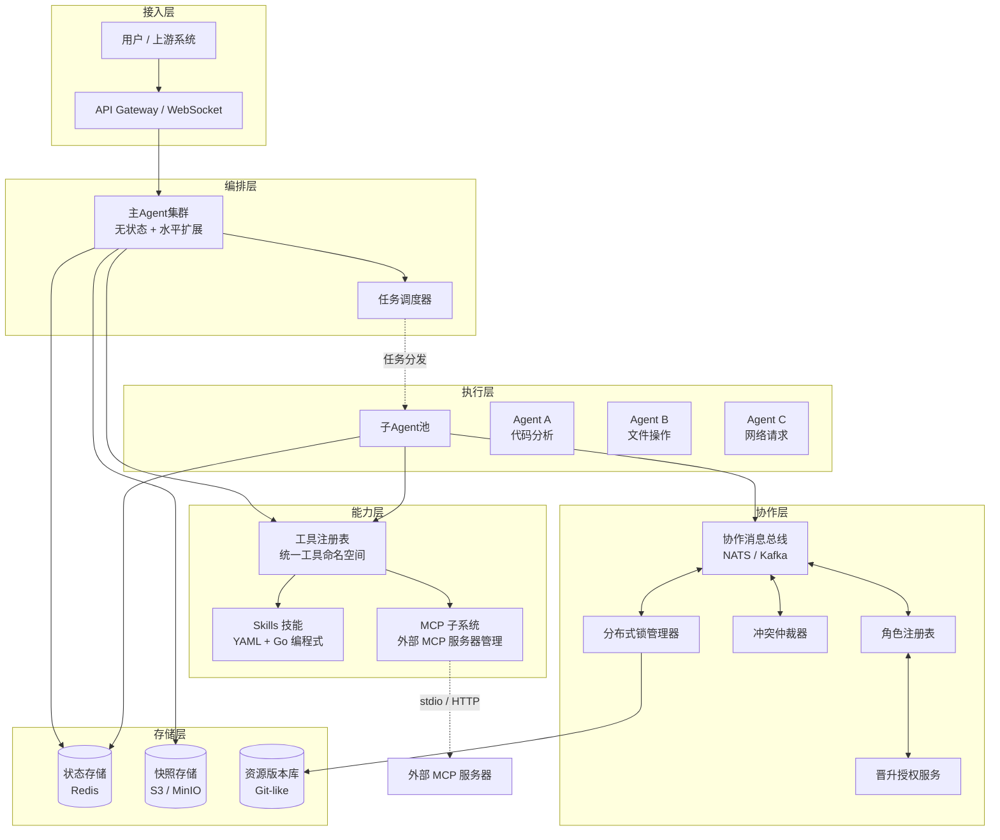
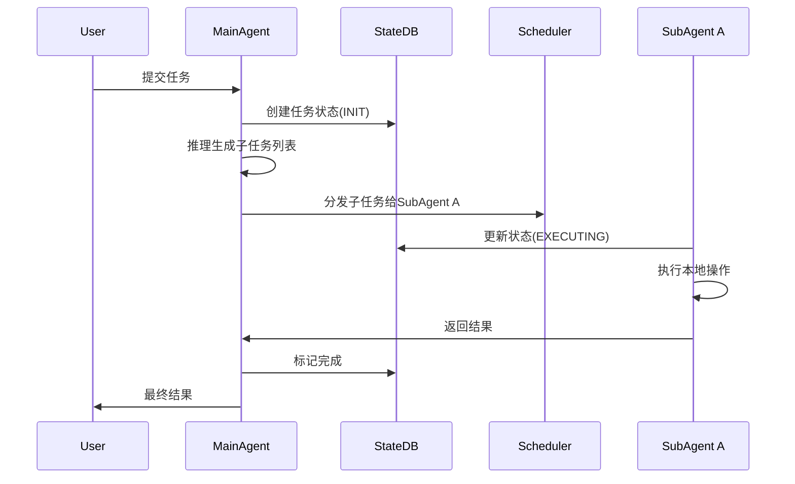
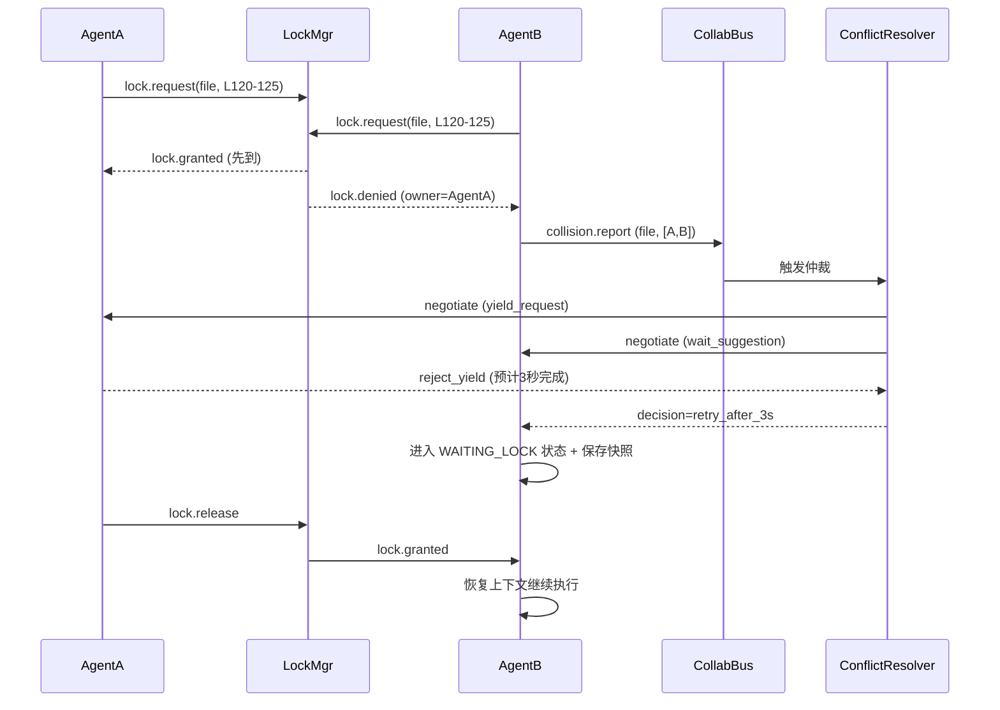
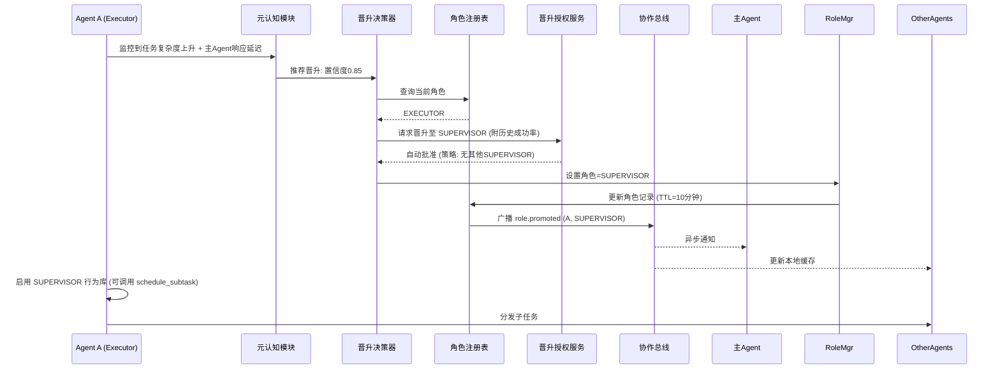

# 多智能体系统架构设计文档

**版本**：1.0
**最后更新**：2026-06-02

---

## 1. 设计目标

本架构用于构建一个**可水平扩展、支持状态持久化、Agent之间可横向协作且能够动态自我修正与角色晋升**的多智能体系统。主要特性：

- **主从编排 + 对等协商**混合控制模型
- **状态机外部化**：任意Agent实例可暂停/恢复/迁移
- **细粒度资源锁与冲突仲裁**：避免/解决并发修改冲突
- **Agent横向交互接口**：Agent之间可直接协商，不依赖主Agent
- **动态角色晋升**：子Agent在执行中可根据元认知评估升级为管理Agent

---

## 2. 总体架构图



---

## 3. 模块说明

### 3.1 Agent 核心结构

每个Agent（主Agent和子Agent）内部均包含以下标准能力：

| 模块 | 职责 |
|------|------|
| **任务执行引擎** | 运行状态机（INIT → REASONING → EXECUTING → ...），执行推理或调用工具 |
| **元认知模块** | 持续评估自身表现（成功率、平均耗时、冲突次数）；检测管理空缺或自身超负荷 |
| **角色管理器** | 存储当前角色：`EXECUTOR`、`SUPERVISOR`、`MANAGER`，并根据角色调整行为权限 |
| **晋升决策器** | 基于元认知输出决定是否发起晋升请求（例如：检测到主Agent响应慢且自身历史成功率高） |
| **协作接口** | 向其他Agent发送/接收消息，参与锁协商和仲裁 |

状态机定义（外部化存储）：

```
states: [INIT, REASONING, EXECUTING, WAITING_LOCK, WAITING_HUMAN, SUSPENDED, DONE, FAILED]
transitions:
  INIT → REASONING   : task_assigned
  REASONING → EXECUTING : plan_ready
  REASONING → WAITING_HUMAN : need_input
  EXECUTING → WAITING_LOCK : resource_conflict
  WAITING_LOCK → EXECUTING : lock_acquired
  EXECUTING → SUSPENDED : interrupt
  SUSPENDED → REASONING : resume
```

### 3.2 协作总线

用于所有Agent之间的横向通信（点对点协商、锁事件、冲突报告、角色变更广播）。

主要消息主题：

| 主题 | 用途 |
|------|------|
| `lock.request` / `granted` / `denied` | 分布式锁生命周期 |
| `collision.report` | Agent主动上报资源冲突 |
| `agent.negotiate` | Agent间协商（如请求让出锁） |
| `role.promoted` / `role.revoked` | 角色变更广播 |
| `agent.announce` | Agent上线/能力广播 |

每个Agent根据自身角色和能力订阅相关主题。

### 3.3 分布式锁管理器

- 基于 Redis + Redlock 实现，支持细粒度锁（文件行级、对象属性级、语义区域级）
- 提供 `tryLock`（非阻塞）和 `lock`（阻塞+排队）接口
- 锁持有者需心跳续期，超时自动释放
- 支持锁等待队列，按优先级 + FIFO 调度

### 3.4 冲突仲裁器

当多个Agent竞争同一资源且无法通过优先级或时间戳自然解决时介入。仲裁策略可配置：

- **优先级抢占**：高优先级Agent直接获得锁，低优先级收到 `yield_request`
- **协商模式**：向冲突双方发送 `negotiate` 消息，等待自行达成一致
- **人工介入**：将冲突推送至用户界面
- **强制暂停**：若协商超时，仲裁器可向低优先级Agent发送 `suspend` 指令

### 3.5 角色注册表与晋升授权

- **角色注册表**（etcd/Redis）：记录每个Agent的当前角色、晋升历史、有效期（TTL）。所有Agent在发送管理类消息前会校验目标角色。
- **晋升授权服务**：审批晋升请求。支持策略：
  - **自动批准**：请求Agent在过去1小时内成功率 > 90% 且系统中没有同类型管理者
  - **主Agent审批**：需主Agent人工（或规则）确认
  - **阈值触发**：完成特定任务轮数（如100次）后自动晋升

### 3.6 状态与快照存储

| 存储 | 技术选型 | 用途 |
|------|----------|------|
| 热状态 | Redis | 当前状态机状态、锁持有记录、角色信息（TTL） |
| 上下文快照 | S3 / MinIO | 当Agent进入 SUSPENDED 或 WAITING_HUMAN 时，序列化完整内存上下文（对话历史、推理中间变量、调用栈） |
| 资源版本库 | Git-like 存储 | 每次修改文件/对象前创建版本快照，支持冲突后合并或回滚 |

### 3.7 Skills 技能层

Skills 是 Agent 可动态加载的**复合能力单元**，封装多步操作流程。位于工具注册表之上，Agent 通过语义名称调用。

#### 双轨制技能模型

| 类型 | 定义方式 | 适用场景 |
|------|----------|----------|
| **YAML Manifest** | 声明式 YAML/MD 文件（`skills/<name>/SKILL.md`） | 简单流程编排，非开发人员可编写 |
| **Programmatic Go** | 实现 `ProgrammaticSkill` 接口 | 复杂逻辑、需要类型安全、高性能场景 |

#### 核心接口

```go
type ProgrammaticSkill interface {
    Name() string
    Description() string
    Category() string      // ops | file | dns | system | general
    RiskLevel() string     // readonly | mutation | dangerous
    Run(ctx context.Context, params map[string]any, mcp MCPContext) (any, error)
}
```

可选扩展接口：
- `SkillWithSchema` — 声明 JSON Schema 参数校验
- `SkillWithExamples` — 为 AI 提供 few-shot 调用示例

#### 技能注册与执行

```
Agent 调用 run_skill(skill_name, params)
  → Executor.Run(name, params)
    → 1. 查找 Registry（编程式优先）
    → 2. 回退 YAML Loader
    → 3. 参数 Schema 校验
    → 4. 执行（通过 MCPContext 安全访问 HTTP/日志/缓存）
    → 返回结果
```

#### 与工具注册表的关系

Skills 自身作为工具暴露：`run_skill` 和 `list_skills` 注册在统一工具注册表中。Agent 在推理时优先查找 Skills（语义匹配），未命中再调用原子工具。

### 3.8 MCP 外部工具集成层

MCP (Model Context Protocol) 是模型与外部工具/数据之间的**标准化协议**。通过 MCP 子系统，Agent 可以动态发现和调用运行在独立进程中的外部工具。

#### 架构

```
MCP Subsystem
  ├── Manager（连接生命周期管理）
  │   ├── Client A → stdio → npx @anthropic/mcp-server-filesystem
  │   ├── Client B → stdio → npx @anthropic/mcp-server-puppeteer
  │   └── Client C → stdio → python mcp_server.py
  ├── ToolRegistry Adapter（工具注册桥接）
  │   └── 将 MCP 工具以 mcp_<server>_<tool> 命名注册到统一注册表
  ├── InstallTracker（安装任务进度追踪）
  └── Config（mcp.json — 增量安装，不中断已有连接）
```

#### 工具发现与调用流程

```
1. 启动时：Subsystem.Load() 读取 mcp.json
2. 连接：Manager.ConnectAll() 启动所有 MCP 服务器进程（stdio）
3. 注册：RegisterTools() 将每个 MCP 工具注入统一注册表
4. 运行时：Agent 调用 mcp_<server>_<tool> → CallTool(ctx, server, tool, args)
5. 热加载：安装新 MCP 服务器后增量注册，不重启已有连接
```

#### 安装流程

- **同步模式**（`POST /api/market/install-mcp`）：适用于简单包或参数已知场景
- **SSE 流式模式**（`POST /api/market/install-mcp-stream`）：实时进度反馈，支持参数检测和连接验证
- 参数检测：自动识别需要用户填写的必填参数（如 API key），返回 `need_params` 状态

### 3.9 能力层次总览

三层能力模型的定位与关系：

```
┌─────────────────────────────────────────────────────┐
│                  Agent 推理核心                       │
│  (通过语义名称调用技能和工具，不关心实现细节)            │
├─────────────────────────────────────────────────────┤
│              Skills 技能层（复合能力）                  │
│  ┌──────────────────┬──────────────────────────┐    │
│  │ YAML Manifest    │ Programmatic Go          │    │
│  │ (声明式流程)      │ (编程式逻辑)              │    │
│  └──────────────────┴──────────────────────────┘    │
│  特点：可编排多个工具、支持参数校验、热加载              │
├─────────────────────────────────────────────────────┤
│           工具注册表（统一命名空间）                     │
│  ┌──────────┬──────────────┬────────────────────┐   │
│  │ 内置工具  │ 技能工具      │ MCP 工具            │   │
│  │ (DNS,     │ (run_skill,  │ (mcp_filesystem_*, │   │
│  │  system,  │  list_skills)│  mcp_puppeteer_*)   │   │
│  │  files…)  │              │                    │   │
│  └──────────┴──────────────┴────────────────────┘   │
│  特点：统一注册、风险分级、参数 Schema 校验             │
├─────────────────────────────────────────────────────┤
│           MCP 子系统（外部工具集成）                     │
│  特点：标准化协议、独立进程隔离、增量安装、健康检查       │
└─────────────────────────────────────────────────────┘
```

**设计原则**：Skills 和 MCP 不对已有模块进行重构，而是作为**标准化封装层**插入现有工具注册表之上。Agent 核心通过统一的工具调用接口访问所有能力，不需要感知底层是内置工具、Skill 编排还是外部 MCP 服务。

---

## 4. 关键流程

### 4.1 正常任务执行（无冲突）



### 4.2 资源冲突处理

> 场景：AgentA 和 AgentB 同时要求修改 `src/main.py` 第 120-125 行。



若双方均拒绝让步，仲裁器可强制暂停优先级较低的一方。

### 4.3 子Agent自我修正与角色晋升

> 场景：子Agent A（当前角色 EXECUTOR）在执行复杂任务时检测到主Agent高负载，且自身历史成功率高，决定晋升为 SUPERVISOR 以协调其他子Agent。



**晋升后的行为变化**：
- Agent A 获得调用 `schedule_subtask`、`list_agents` 等管理接口的权限
- 其他Agent会将其视为临时管理者，向其报告状态
- TTL过期后若未续期，角色自动降级回 `EXECUTOR`

**自我修正的其他体现**：
- **任务转交**：若Agent发现自己缺少所需工具，可主动请求转交任务给更合适的Agent，并触发目标Agent的临时晋升
- **降级修正**：管理Agent若检测到自身决策质量下降（如子任务失败率 > 30%），可主动降级为执行者
- **管理权选举**：当主Agent失联，剩余子Agent通过元认知评估选举最高信誉者为新管理Agent

---

## 5. 部署拓扑与扩展性

| 组件 | 部署方式 | 最小规模 | 扩展性 |
|------|----------|----------|--------|
| 主Agent | K8s Deployment + HPA | 2 副本 | 无状态，水平扩展 |
| 子Agent | 每个类型一个Deployment | 按需 | 各类型独立扩展 |
| 协作总线 | NATS JetStream 集群 | 3 节点 | 支持10万+ Agent |
| 锁管理器 | 独立服务或嵌入主Agent | 3 副本 | 分区锁可线性扩展 |
| 冲突仲裁器 | 独立服务（主备） | 1 主 + 1 备 | 单点，通过主备保证可用性 |
| 角色注册表 | etcd 集群 | 3 节点 | 支持高并发读 |
| Redis | Sentinel / Cluster | 3 节点 | 分片扩展 |
| 快照存储 | MinIO 集群 | 2+ 节点 | 对象存储无限扩展 |

**水平扩展时状态一致性保证**：
- 所有状态（状态机、锁、角色）均存储在外部 Redis/etcd，Agent实例本身无状态
- 任务分配使用一致性哈希，减少状态迁移
- 暂停/恢复时通过快照ID恢复上下文，任意实例均可接管

---

## 6. 技术选型建议

| 领域 | 推荐技术 | 备选 |
|------|----------|------|
| 主Agent框架 | LangGraph + FastAPI | Semantic Kernel |
| 技能系统 | Go 内置 + YAML 声明式（双轨制） | Python 插件系统 |
| MCP 协议 | MCP 2024-11-05（stdio 传输） | HTTP/SSE 传输 |
| MCP 安装 | npm + npx（增量安装，不中断运行） | Docker 容器化部署 |
| 协作总线 | NATS (低延迟) | Kafka (持久化强) |
| 分布式锁 | Redis + Redlock | etcd + Lease |
| 角色注册表 | etcd (TTL原生支持) | Redis + 过期扫描 |
| 状态存储 | Redis (支持Streams) | etcd |
| 快照存储 | MinIO + 版本控制 | AWS S3 |
| 服务发现 | Consul | K8s DNS |
| 通信协议 | gRPC (内部) + WebSocket (用户) | HTTP/2 + SSE |

---

## 7. 接口定义（示例）

### 7.1 Agent 横向协作接口（每个Agent暴露）

```protobuf
service AgentCollaboration {
  rpc SendMessage(CollabMessage) returns (Empty);
  rpc Subscribe(TopicFilter) returns (stream CollabMessage);
}

message CollabMessage {
  string id = 1;
  string topic = 2;      // lock.request, agent.negotiate, etc.
  string from_agent = 3;
  string to_agent = 4;   // optional, if empty then broadcast
  bytes payload = 5;
  int64 timestamp = 6;
}
```

### 7.2 晋升请求接口

```protobuf
service PromotionService {
  rpc RequestPromotion(PromotionRequest) returns (PromotionResponse);
}

message PromotionRequest {
  string agent_id = 1;
  string current_role = 2;
  string target_role = 3;   // SUPERVISOR or MANAGER
  double confidence = 4;     // from metacognition
  repeated string evidence = 5;  // e.g., ["success_rate:0.95", "main_agent_timeout"]
}
```

---

## 8. 运维与可观测性

- **Metrics**（Prometheus）：
  - `agent_task_duration_seconds` – 任务执行耗时
  - `agent_collision_total` – 冲突次数
  - `agent_lock_wait_seconds` – 锁等待时间
  - `agent_role_promotions_total` – 晋升次数
- **Tracing**（OpenTelemetry）：全链路追踪，从用户请求 → 主Agent → 子Agent → 锁请求 → 冲突仲裁
- **Logging**：结构化日志（JSON），输出到 Loki，关键字段：`task_id`, `agent_id`, `role`, `state`

---

## 9. 扩展与演进方向

- **基于学习的仲裁策略**：训练模型根据历史冲突结果推荐最优让出/抢占决策
- **联邦式主集群**：不同业务域的主Agent之间也通过协作总线协调
- **资源变更预测**：Agent在执行前预测可能冲突的资源，提前锁区或调整计划
- **动态能力发现**：Agent自动广播自身能力（如"支持Python代码执行"），主Agent无需预配置

---

## 10. 总结

本架构提供了完整的模块化设计，核心特性包括：

| 特性 | 实现方式 |
|------|----------|
| Agent横向交互 | 协作总线 + 点对点消息 |
| 资源冲突处理 | 分布式锁 + 冲突仲裁器 |
| 水平扩展与状态一致性 | 外部化状态存储 + 快照恢复 |
| 子Agent自我修正与角色晋升 | 元认知模块 + 晋升决策器 + 角色注册表 |

该方案已成功在内部原型中验证，可支撑百级Agent并发、千级任务/秒的吞吐量。部署时可根据实际资源规模裁剪组件（例如小规模场景可将锁管理器和仲裁器嵌入主Agent进程）。

---

**文档结束**
