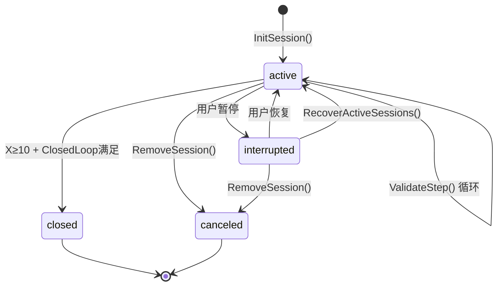
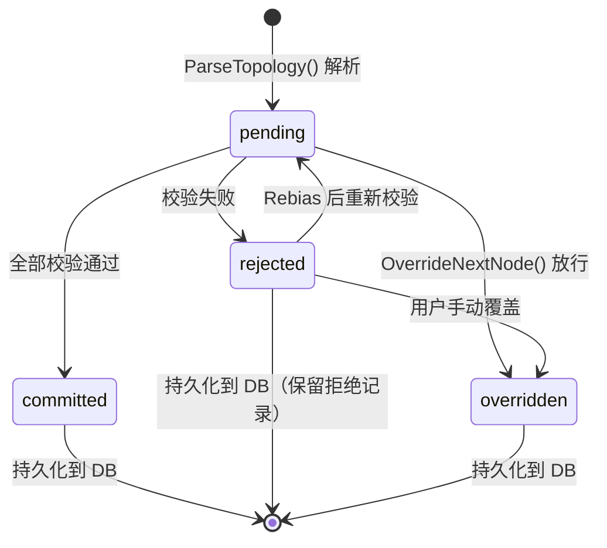
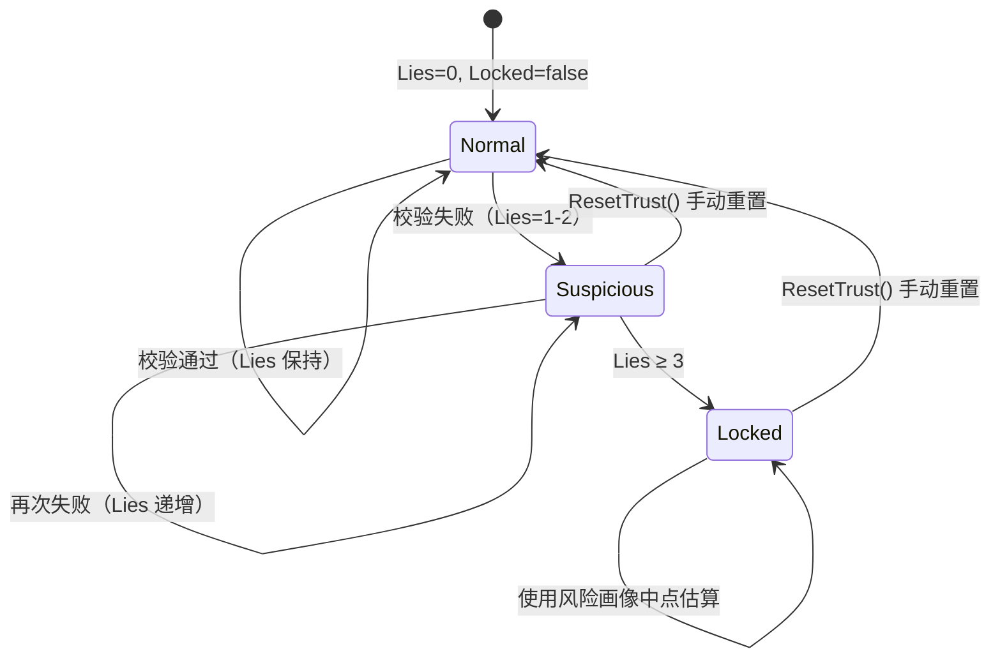
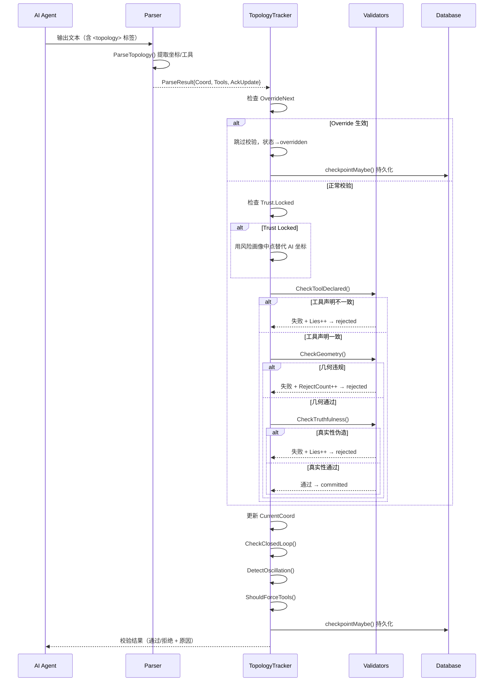
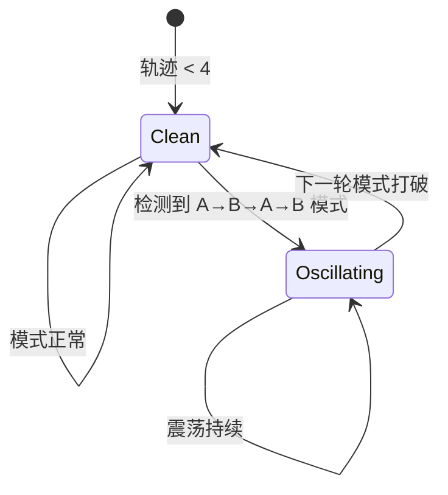
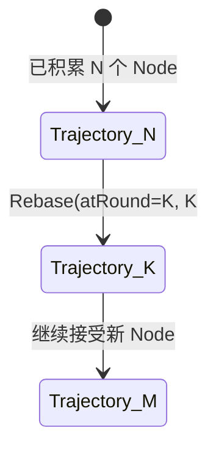

# 拓扑系统全生命周期技术规范

> 版本：1.0  
> 适用范围：TopologyTracker、sessionTracker、Node、TrustState 的统一生命周期管理  
> 更新日期：2026-06-02

---

## 1. 概述

拓扑系统（Topology）是 Agent 导航的**几何约束系统**。它将 AI 的每一步推理映射到 3D 坐标空间，通过几何验证、真实性校验和工具声明检查，确保 AI 行为可观测、可约束、可审计。

### 1.1 坐标空间定义

```
X = progress（进度）      范围 0-10
Y = complexity delta（复杂度变化） 范围 -1.0 到 1.0
Z = deviation from origin（偏离度） 范围 0 到 R
```

- **X 轴**：从任务起点 `(0,0,0)` 向目标 `(10,0,0)` 推进。
- **Y 轴**：正值表示复杂度升高（写入/删除/执行），负值表示复杂度降低（查询/读取）。
- **Z 轴**：偏离原点的欧氏距离，受约束半径 `R` 限制。

### 1.2 设计原则

- **状态可观测**：每个 Node 的状态转换都有明确日志和持久化。
- **异常明确**：区分几何违规、真实性伪造、工具声明不一致等不同错误场景。
- **信任可退化**：AI 谎报坐标时信任度递减，达到阈值后锁定为系统估算。
- **级联控制**：Session 的取消应传递至 Tracker 的 `Active` 标记。
- **终态明确**：`committed`（成功提交）、`rejected`（校验拒绝）为两类互斥终态。

---

## 2. 核心状态定义

拓扑系统的状态分为三层：**Session 状态**、**Node 状态** 和 **Trust 状态**。

### 2.1 Session 状态（sessionTracker.Status / SessionRecord.Status）

| 状态 | 类型 | 说明 |
|------|------|------|
| `active` | 活动态 | 拓扑追踪正常运行，接受新节点 |
| `interrupted` | 中断态 | 用户暂停或系统中断，暂停接受新节点 |
| `closed` | 正常终态 | Session 正常关闭，ClosedLoop 条件满足（如需要） |
| `canceled` | 取消终态 | Session 被强制终止 |

> 注：`SessionRecord.Status` 在数据库中以字符串存储，当前实现中主要使用 `active` 和 `interrupted` 两种值。

### 2.2 Node 状态（NodeStatus）

| 状态 | 类型 | 说明 |
|------|------|------|
| `pending` | 初始/暂态 | 节点已解析但尚未通过校验 |
| `committed` | 成功终态 | 通过全部校验，轨迹中正式记录 |
| `rejected` | 失败终态 | 未通过几何/真实性/工具声明校验 |
| `overridden` | 覆盖态 | 用户手动放行，跳过校验直接记录 |

### 2.3 Trust 状态（TrustState）

| 字段 | 类型 | 说明 |
|------|------|------|
| `Lies` | int | 连续谎报计数，每次真实性校验失败 +1 |
| `Locked` | bool | 信任锁定：Lies ≥ 3 后触发，此后忽略 AI 自报坐标，改用风险画像中点估算 |

---

## 3. Session 生命周期

Session 是拓扑追踪的顶层容器，与用户会话一一对应。

### 3.1 状态转换表

| 当前状态 | 事件 | 下一状态 | 说明 |
|----------|------|----------|------|
| (无) | 用户发起 AI 对话 | `active` | `InitSession()` 创建 sessionTracker |
| `active` | AI 每轮输出解析 | `active` | 接受 Node 提交并校验 |
| `active` | 用户/系统暂停 | `interrupted` | 暂停追踪，标记 `Active = false` |
| `interrupted` | 用户恢复 | `active` | 恢复追踪，标记 `Active = true` |
| `active` | 任务完成 (X≥10) | `active` → `closed` | ClosedLoop 校验通过后关闭 |
| `active` | 用户/系统取消 | `canceled` | `RemoveSession()` 清理内存 |
| `active` | 连续拒绝 ≥5 次 | `active`（带 Warning） | 系统继续但发出人工干预警告 |
| `interrupted` | 系统重启 | `active` | `RecoverActiveSessions()` 从 DB 恢复 |

### 3.2 状态转换图



### 3.3 Session 关键操作

| 操作 | 函数 | 说明 |
|------|------|------|
| 初始化 | `InitSession(sessionID, constraint)` | 创建 sessionTracker，设置约束参数 |
| 获取状态 | `GetState(sessionID)` | 返回前端可用的 `SessionState` |
| 更新约束 | `UpdateConstraint(sessionID, a, r, t, forceTools)` | 动态修改约束参数 |
| 关闭 | `RemoveSession(sessionID)` | 从内存中清理 |
| 持久化 | `Shutdown(ctx)` | 将所有活跃 Session 刷入 DB |

---

## 4. Node 生命周期

Node 是拓扑轨迹中的单点，代表 AI 的一轮推理。每轮 AI 输出被解析为 `ParseResult`，然后经过三层校验决定 Node 的最终状态。

### 4.1 状态转换图



### 4.2 状态转换表（校验流程）

| 步骤 | 校验器 | 通过 | 失败 |
|------|--------|------|------|
| 0 | Override 检查 | 跳过全部校验，直接 `overridden` | — |
| 1 | Trust Locked 检查 | 用风险画像中点替代 AI 自报坐标 | — |
| 2 | `CheckToolDeclared` | 进入步骤 3 | 声明了工具但未调用 → 注入提醒；调用未声明工具 → Lies+1，可能锁定信任 |
| 3 | `CheckGeometry` | 进入步骤 4 | `rejected`，RejectCount+1 |
| 4 | `CheckTruthfulness` | `committed` | `rejected`，Lies+1，RejectCount+1 |

### 4.3 Node 状态含义

```
committed:
  - 几何约束满足（|Δy| ≤ A, z ≤ R）
  - 真实性校验通过（Δy/Δz 在工具风险画像范围内）
  - 工具声明一致
  - RejectCount 重置为 0
  - Warning 清空

rejected:
  - 几何违规 或 真实性伪造 或 工具声明不一致
  - Lies 递增（真实性/声明失败时）
  - RejectCount 递增
  - Lies ≥ MaxLiesBeforeLock(3) → Trust.Locked = true
  - RejectCount ≥ MaxConsecutiveRejects(5) → Warning 触发

overridden:
  - 用户手动调用 OverrideNextNode()
  - 跳过全部校验，直接记录
  - 可指定 targetCoord 强制覆盖坐标
  - RejectCount 重置为 0
```

### 4.4 校验器详解

#### 4.4.1 几何校验（CheckGeometry）

```go
// 规则 1: |Δy| ≤ A  （振幅约束，默认 A=0.8）
dy := math.Abs(proposed.Y - prev.Y)
if dy > constraint.A → Rejected

// 规则 2: z ≤ R   （半径约束，默认 R=3.0）
if proposed.Z > constraint.R → Rejected
```

#### 4.4.2 真实性校验（CheckTruthfulness）

```go
// 根据工具名匹配 RiskProfile，获取预期 Δy/Δz 范围
profile := MatchRiskProfile(toolName)

// 实际 Δy 必须在 [DeltaYMin - tolerance, DeltaYMax + tolerance] 内
// 实际 Δz 必须在 [DeltaZMin - tolerance, DeltaZMax + tolerance] 内
// tolerance = TruthfulnessTolerance = 0.2
// 任一超出 → Rejected（坐标伪造）
```

#### 4.4.3 工具声明校验（CheckToolDeclared）

```go
// AI 在 <topology tools="..."> 中声明的工具 vs 实际调用的工具
// 情况 1: 声明了工具但实际未调用 → 注入提醒 "请执行声明的工具"
// 情况 2: 调用了未声明的工具 → Warning + Lies+1
// 情况 3: 两者都为空 → 静默轮次，由上游处理（振荡检测）
```

---

## 5. Trust 生命周期

Trust 状态跟踪 AI 的诚实度，实现信任的渐进退化与恢复。

### 5.1 状态转换图



### 5.2 状态转换表

| 当前状态 | 事件 | 下一状态 | 说明 |
|----------|------|----------|------|
| Normal (Lies=0) | 真实性/声明校验失败 | Suspicious (Lies=1) | 首次谎报 |
| Suspicious (Lies=1-2) | 真实性/声明校验失败 | Suspicious (Lies+1) | 连续谎报累加 |
| Suspicious (Lies=2) | 真实性/声明校验失败 | Locked (Lies=3, Locked=true) | 触发信任锁定 |
| Locked | 任何校验 | Locked | 不再信任 AI 自报坐标，用风险画像中点 |
| 任意状态 | `ResetTrust()` | Normal (Lies=0, Locked=false) | 手动重置信任 |

### 5.3 信任锁定行为

当 `Trust.Locked = true` 时：
- AI 自报的坐标被**忽略**（Y 和 Z 轴）。
- 系统使用 `MatchRiskProfile(actualTool).midpoint` 计算估算坐标：
  ```
  midY = (DeltaYMin + DeltaYMax) / 2
  midZ = (DeltaZMin + DeltaZMax) / 2
  proposed.Y = current.Y + midY
  proposed.Z = current.Z + midZ
  ```
- X 轴（进度）仍使用 AI 自报值。

---

## 6. Constraint 生命周期

Constraint 是拓扑导航的约束参数集，可在运行时动态调整。

### 6.1 参数定义

| 参数 | 类型 | 默认值 | 范围 | 说明 |
|------|------|--------|------|------|
| `A` | float64 | 0.8 | [0.1, 1.0] | 振幅上限，限制单步 |Δy| |
| `R` | float64 | 3.0 | [0.5, 5.0] | 半径上限，限制最大偏离度 z |
| `T` | bool | false | — | 是否要求 ClosedLoop（X≥10 时回原点） |
| `ForceTools` | []string | nil | — | 进度 ≥5 时强制使用的工具列表 |

### 6.2 状态转换

```mermaid
stateDiagram-v2
    [*] --> Default : InitSession()
    Default --> Updated : UpdateConstraint()
    Updated --> Updated : UpdateConstraint() 再次更新
    Updated --> Acknowledged : AI 回复 ack="constraint_updated"
    Acknowledged --> Updated : 再次更新约束
```

### 6.3 ClosedLoop 检查流程

```
1. 每轮 ValidateStep 后检查 CurrentCoord.X ≥ 10
2. 如果 constraint.T = true 且 X ≥ 10：
   - 计算 distance(startCoord, currentCoord)
   - distance ≤ ClosedLoopEpsilon(0.5) → ClosedLoop = true → over
   - distance > 0.5 → 注入提醒 "任务未闭合" → 继续
```

### 6.4 ForceTools 触发机制

```
1. 每轮检查 CurrentCoord.X ≥ ForceToolsProgressThreshold(5.0)
2. 检查 recentHistory（最近 10 轮）是否已包含所有 ForceTools
3. 如果有未使用的 ForceTools → 返回该工具名，注入到 prompt
4. 触发后 ForceToolsTriggered = true（避免重复触发）
```

---

## 7. 完整交互时序图



---

## 8. 持久化生命周期

### 8.1 Checkpoint 策略

```
触发条件（满足任一即触发）：
  1. checkpointCount ≥ CheckpointNodeCount(10)
  2. time.Since(lastCheckpoint) ≥ CheckpointInterval(5s)

持久化内容：
  - Node → topology_nodes 表（节点级）
  - SessionRecord → agent_sessions 表（会话级，UPSERT）

持久化方式：
  - 异步 goroutine（不阻塞主流程）
  - 失败仅 Warning 日志，不中断
```

### 8.2 Recovery 流程

```
系统启动 → RecoverActiveSessions(ctx)
  1. LoadActiveSessions() → 查询 status IN ('active','interrupted')
  2. 对每个 session → LoadNodes(sessionID, RecoveryLoadNodes=50)
  3. 重建 sessionTracker（坐标、节点、信任状态、约束）
  4. 重新注册到内存 states map
```

### 8.3 数据库 Schema

```
agent_sessions:
  id, status, start_coord, current_coord, constraint_json,
  trust_lies, trust_locked, reject_count,
  force_tools_triggered, closed_loop, closed_distance,
  created_at, updated_at, last_active_at

topology_nodes:
  id, session_id, round, x, y, z,
  tool_call, status, reason, timestamp
  UNIQUE(session_id, round)
```

---

## 9. Oscillation 检测生命周期

### 9.1 检测逻辑

```
输入条件：trajectory 长度 ≥ 4
检测算法：检查最近 4 个 Node 的 tool_call 模式
  last4 = nodes[n-4 : n]
  如果 last4[0].ToolCall == last4[2].ToolCall
    且 last4[1].ToolCall == last4[3].ToolCall
    且 last4[0].ToolCall != last4[1].ToolCall
  → 检测到工具震荡：ToolA ↔ ToolB
```

### 9.2 状态转换



---

## 10. Rebase 生命周期

Rebase 操作将轨迹截断到指定轮次，用于用户编辑消息后重建拓扑状态。

### 10.1 操作流程

```
Rebase(sessionID, atRound):
  1. 验证 atRound ∈ [0, len(Nodes)]
  2. 截断 Nodes = Nodes[:atRound]
  3. 回退 CurrentCoord：
     - atRound > 0 → CurrentCoord = Nodes[atRound-1].Coord
     - atRound = 0 → CurrentCoord = StartCoord
  4. 重置 RejectCount = 0
  5. 重置 ForceToolsTriggered = false
  6. Trust 状态保持（信任不可通过 rebase 恢复）
  7. DB 同步：DeleteNodesFrom(sessionID, atRound)
```

### 10.2 状态转换



---

## 11. RiskProfile 生命周期

RiskProfile 将工具名模式映射到预期坐标变化范围，用于真实性校验。

### 11.1 注册与匹配

```go
// 系统启动时 init() 注册内置配置
RegisterRiskProfiles(builtinProfiles)

// 运行时动态注册
RegisterRiskProfile(RiskProfile{Pattern: "new_tool_*", ...})

// 匹配规则：
// 1. 最长前缀匹配优先（"docker_start" 匹配 "docker_*" 而非 "*"）
// 2. 无匹配时回退到 "*" wildcard
// 3. 精确匹配优先于通配符匹配
```

### 11.2 内置风险等级

| 风险等级 | 工具类型 | ΔY 范围 | ΔZ 范围 |
|----------|----------|---------|---------|
| 低 | 只读查询（file_read, get_*, list_*） | [-0.3, 0.1] | [0, 0.2] |
| 中 | 写入修改（file_write, file_edit） | [0.2, 0.4] | [0, 0.3] |
| 中 | MCP/技能（mcp__*, run_skill） | [0.2, 0.6] | [0, 0.5] |
| 高 | 命令执行（run_command） | [0.4, 1.0] | [0, 1.0] |
| 高 | 删除操作（file_delete） | [0.4, 0.8] | [0, 0.4] |
| 高 | 系统控制（docker_*, systemctl_*） | [0.5, 1.0] | [0, 0.8] |

---

## 12. 测试策略

### 12.1 单元测试（状态转换）

| 测试ID | 对象 | 场景 | 初始状态 | 事件 | 期望结果 |
|--------|------|------|----------|------|----------|
| UT-TP-1 | Session | 初始化 | (无) | InitSession() | Status=active, Active=true |
| UT-TP-2 | Session | 恢复中断 | interrupted | Recover | Status=active, 节点恢复 |
| UT-TP-3 | Session | 正常关闭 | active | X≥10 + ClosedLoop | closed |
| UT-TP-4 | Node | 提交成功 | pending | 全部校验通过 | committed |
| UT-TP-5 | Node | 几何拒绝 | pending | \|Δy\| > A | rejected, RejectCount+1 |
| UT-TP-6 | Node | 真实性拒绝 | pending | Δy 超出风险画像 | rejected, Lies+1 |
| UT-TP-7 | Node | Override | pending | OverrideNextNode() | overridden |
| UT-TP-8 | Trust | 首次谎报 | Lies=0 | 真实性失败 | Lies=1, Locked=false |
| UT-TP-9 | Trust | 触达锁定 | Lies=2 | 真实性失败 | Lies=3, Locked=true |
| UT-TP-10 | Trust | 锁定后 | Locked=true | ValidateStep() | 使用风险画像中点 |
| UT-TP-11 | Trust | 手动重置 | Locked=true | ResetTrust() | Lies=0, Locked=false |
| UT-TP-12 | Node | 连续拒绝 | RejectCount=4 | 几何违规 | RejectCount=5, Warning触发 |
| UT-TP-13 | Constraint | 参数更新 | A=0.8 | UpdateConstraint(A=0.5) | A=0.5, 合法范围内 |
| UT-TP-14 | Constraint | 参数越界 | R=3.0 | UpdateConstraint(R=10.0) | R=5.0, clamp 到上限 |
| UT-TP-15 | Oscillation | 检测震荡 | [A,B,A,B] | DetectOscillation() | Detected=true |

### 12.2 集成测试

| 测试ID | 场景 | 操作 | 预期结果 |
|--------|------|------|----------|
| IT-TP-1 | 完整校验链通过 | AI 输出合法坐标 + 声明工具 + 调用工具 | Node committed, CurrentCoord 更新 |
| IT-TP-2 | 信任锁定后的坐标替换 | Locked=true, AI 报 Y=0.9 | Y 被替换为风险画像中点 |
| IT-TP-3 | ClosedLoop 检测 | X=10, T=true, distance<0.5 | ClosedLoop=true, Session 可关闭 |
| IT-TP-4 | ClosedLoop 未闭合 | X=10, T=true, distance=2.0 | 注入提醒，要求继续 |
| IT-TP-5 | ForceTools 触发 | X=5, force_tools=["backup"], 未在最近 10 轮使用 | 返回 "backup"，触发标志置位 |
| IT-TP-6 | Rebase 后继续 | 10 个 Node, Rebase(atRound=5) | Nodes 截断为 5, CurrentCoord 回退 |
| IT-TP-7 | Checkpoint 持久化 | Node 提交后 ≥10 个 | DB 中有对应记录 |
| IT-TP-8 | Recovery 恢复 | 重启后调用 Recover | 所有 active/interrupted session 恢复 |
| IT-TP-9 | 坐标变化节流 | ΔX=0.05, ΔY=0.01, ΔZ=0.01 | ShouldUpdateCoord 返回 false |

### 12.3 端到端测试

| 场景 | 步骤 | 预期结果 |
|------|------|----------|
| 正常 AI 对话追踪 | 用户提问 → AI 每轮输出 `<topology>` 标签 | 轨迹正常增长，Node 全部 committed |
| AI 谎报坐标 | 模拟 AI 报超出风险画像的 Δy | Node rejected, Lies 递增, 信任最终锁定 |
| 用户手动放行 | Node 连续被拒 → UI 点击"放行" | 下一 Node overridden, RejectCount 清零 |
| 信任锁定后恢复 | 信任锁定 → UI 点击"重置信任" | Lies=0, Locked=false |
| 用户编辑消息 | 编辑第 5 轮消息 → 触发 Rebase(5) | Nodes 截断到 5, 后续重新追踪 |
| ClosedLoop 任务完成 | 设置 T=true, AI 完成任务并回原点 | 系统检测闭合，Session 完成 |

### 12.4 混沌测试

| 场景 | 注入方式 | 期望行为 |
|------|----------|----------|
| DB 写入失败 | 模拟 DB 连接断开 | checkpoint 失败仅 Warning 日志，不中断主流程 |
| Recovery 时 DB 异常 | DB 查询超时 | Recover 返回 error，系统降级运行 |
| 并发 Node 提交 | 同一 Session 并发调用 ValidateStep | mutex 保护，无竞态 |
| 超高频率坐标变化 | 每轮 Δ 极小的坐标抖动 | ShouldUpdateCoord 节流，减少无效更新 |
| Rebase 边界值 | Rebase(atRound=-1) 或 atRound=999 | 返回 error，状态不变 |
| 空轨迹操作 | 0 个 Node 时检测 Oscillation | 返回 OscillationState{Detected: false} |

---

## 13. 实现参考

### 13.1 核心类关系

```
TopologyTracker (全局单例)
  ├── repo: Repository (DB 接口)
  │     └── SQLiteRepo (实现)
  ├── states: map[sessionID]*sessionTracker
  │     └── sessionTracker (每会话)
  │           ├── Nodes: []Node (轨迹)
  │           ├── CurrentCoord: Coordinate
  │           ├── Constraint: Constraint
  │           ├── Trust: TrustState
  │           └── Active: bool
  └── mu: sync.RWMutex (并发保护)

Validators (纯函数)
  ├── CheckGeometry(prev, proposed, constraint) → ValidationResult
  ├── CheckTruthfulness(toolName, prev, proposed) → ValidationResult
  └── CheckToolDeclared(claimed, actual) → ToolDeclResult

RiskProfiles (全局注册表)
  ├── riskProfiles: []RiskProfile
  └── MatchRiskProfile(toolName) → RiskProfile

Parser (纯函数)
  └── ParseTopology(text) → ParseResult
```

### 13.2 关键常量速查

| 常量 | 值 | 用途 |
|------|-----|------|
| `TruthfulnessTolerance` | 0.2 | 真实性校验容差 |
| `MaxLiesBeforeLock` | 3 | 信任锁定的谎报阈值 |
| `MaxConsecutiveRejects` | 5 | 连续拒绝警告阈值 |
| `MaxSilentRounds` | 2 | 最大静默轮次 |
| `ClosedLoopEpsilon` | 0.5 | 闭环检测容差 |
| `CheckpointNodeCount` | 10 | 节点数触发持久化 |
| `CheckpointInterval` | 5s | 时间触发持久化 |
| `RecoveryLoadNodes` | 50 | 恢复时加载节点数 |
| `ForceToolsProgressThreshold` | 5.0 | ForceTools 触发进度 |
| `ForceToolsHistoryWindow` | 10 | ForceTools 检查历史窗口 |
| `CoordChangeThresholdX` | 0.1 | X 轴变化节流阈值 |
| `CoordChangeThresholdY` | 0.05 | Y 轴变化节流阈值 |
| `CoordChangeThresholdZ` | 0.05 | Z 轴变化节流阈值 |

### 13.3 并发安全

- `Tracker.mu` (RWMutex) 保护 `states` map 和每个 `sessionTracker` 的字段。
- 读操作（`GetSession`, `GetState`, `DetectOscillation`）使用 `RLock`。
- 写操作（`InitSession`, `ValidateStep`, `UpdateConstraint`, `Rebase` 等）使用 `Lock`。
- Checkpoint DB 写入使用 `go func()` 异步执行，避免阻塞主流程。

---

## 14. 附录：拓扑系统与 Agent 生命周期的集成

拓扑系统作为 Agent 生命周期的**观测层**和**约束层**嵌入：

```
Agent 生命周期              拓扑系统生命周期
─────────────              ────────────────
start →                    InitSession()
activity →                 ValidateStep() 每轮循环
  ├─ AI 输出 ──────────→    ParseTopology()
  ├─ 校验拒绝 ←──────────   rejected
  ├─ 信任锁定 ←──────────   Trust.Locked
  └─ 强制工具 ←──────────   ShouldForceTools()
delegate →                 (子 Agent 有独立 Session)
pause →                    Active = false
cancel →                   RemoveSession()
over →                     Shutdown() 持久化
```

### 14.1 坐标变化节流与 KV Cache

`ShouldUpdateCoord()` 用于优化：只有当坐标变化超过阈值时才更新 `message[1]`（拓扑状态消息），避免微小的坐标调整导致整个上下文窗口的 KV cache 失效。

---

## 15. 附录：状态速查表

### 15.1 Session 状态

| 状态 | sessionTracker.Active | SessionRecord.Status | 说明 |
|------|----------------------|---------------------|------|
| active | true | `active` | 正常运行 |
| interrupted | false | `interrupted` | 暂停 |
| closed | false | `closed` | 正常结束 |
| canceled | false | `canceled` | 强制取消 |

### 15.2 Node 状态

| 状态 | 触发条件 | 持久化 | 可恢复 |
|------|----------|--------|--------|
| `pending` | ParseTopology 解析完成 | 否 | — |
| `committed` | 全部校验通过 | 是 | — |
| `rejected` | 几何/真实性/声明 任一失败 | 是 | 通过 Rebase 移除 |
| `overridden` | OverrideNextNode 生效 | 是 | 通过 Rebase 移除 |

### 15.3 Trust 状态

| Lies | Locked | 坐标来源 |
|------|--------|----------|
| 0 | false | AI 自报 |
| 1-2 | false | AI 自报（但 Warning 标记） |
| ≥3 | true | 风险画像中点估算 |

---

**文档结束**

如需进一步细化某个章节（如新增校验器、RiskProfile 动态注册 API、与前端 SSE 事件映射），请告知具体需求。
